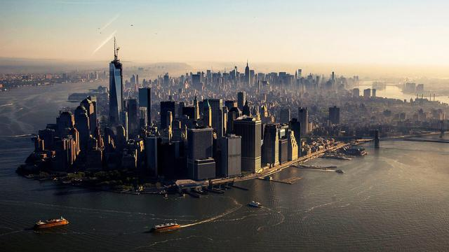

__Civil Services__ is a collection of tools that make it possible for citizens to be a part of what is happening in their Local, State & Federal Governments.

[](https://www.paypal.me/civilservices)


City Council Data for New York, NY
===

[](https://raw.githubusercontent.com/CivilServiceUSA/city-council-ny-new-york/master/LICENSE)  [](https://github.com/CivilServiceUSA/city-council-ny-new-york/graphs/contributors)



<details>
  <summary>Expand City Councilor Pictures</summary>


</details>

New York City Links
---

* [City Website](http://www.nycgo.com)
* [City Council Website](http://council.nyc.gov/html/members/members.shtml)
* [City Council Calendar](http://legistar.council.nyc.gov/Calendar.aspx)
* [City Council Legislation](http://legistar.council.nyc.gov/Legislation.aspx)
* [City Council Committees](http://legistar.council.nyc.gov/Departments.aspx)


Introduction
===

This project provides the __[City Council Data](./city-council)__, Headshots & City Photo for New York, NY ( GeoJSON, JSON, XML, CSV, SQL & YML formats ).  See [Provided Data](#provided-data) below for full list of data in this project.


Completed Tasks
---

We have completed the following Data Collection for New York, NY. [Watch Project](https://github.com/CivilServiceUSA/city-council-ny-new-york/subscription) to be notified of updates.

- [X] City Council Data Created
- [X] City Photo Created
- [X] Councilor Headshots Created
- [X] Images Uploaded to CDN
- [X] GeoJSON File Created
- [X] Published NPM Package

Developers
---

#### Requirements

To run converters, you will need to run the following:

```bash
brew install imagemagick
brew install graphicsmagick
```

#### Rebuild Data & Assets

The `./city-council` folder is generated by the contents in the `./source` folder.  See the [./source/README.md](./source/README.md) file for requirements for the core assets.

To update the data & assets in the `city-council` folder, you will need to run the following commands:

```bash
npm install
npm run -s build
```

#### Provided Data

There are currently about 40 pieces of data for each councilor. You can see the full details below.

<details>
  <summary>Expand Details</summary>

Parameter                           | Type   | Description
------------------------------------|--------|----------------
`state_code`                        | string | Two Letter State Abbreviation
`state_name`                        | string | Name of State
`state_slug`                        | string | Name of State converted to lowercase letters and spaces replaced with dashes
`city_name`                         | string | Name of City
`city_slug`                         | string | Name of City converted to lowercase letters and spaces replaced with dashes
`city_population`                   | string | Population of City
`city_background_url`               | string | Creative Commons Image you can use for City
`city_government_url`               | string | Official Website of City
`city_council_url`                  | string | City Council Official Website
`city_council_council_calendar_url` | string | City Council Calendar Website
`city_council_legislation_url`      | string | City Council Legislation Website
`city_council_committees_url`       | string | City Council Committee Website
`city_latitude`                     | float  | GPS Latitude of City
`city_longitude`                    | float  | GPS Longitude of City
`district`                          | mixed  | District of Councilor ( not always available )
`at_large`                          | enum   | Councilor is considered At-Large
`name`                              | string | Full Name of Councilor
`name_slug`                         | string | Full Name of Councilor converted to lowercase letters and spaces replaced with dashes
`first_name`                        | string | First Name of Councilor
`last_name`                         | string | Last Name of Councilor
`gender`                            | enum   | Gender of Councilor
`ethnicity`                         | enum   | Ethnicity of Councilor
`date_of_birth`                     | date   | Date of Birth of Councilor
`entered_office`                    | date   | Date Councilor First Entered Office
`term_end`                          | date   | Date Councilor's Current Term Ends
`title`                             | enum   | Title of Councilor
`party`                             | enum   | Political Party of Councilor
`email`                             | string | Work Email Address of Councilor
`phone`                             | string | Work Phone Number of Councilor
`address_complete`                  | string | Work Mailing Address of Councilor
`address_number`                    | number | Mailing Address Number
`address_prefix`                    | string | Mailing Address Prefix
`address_street`                    | string | Mailing Address Street
`address_sec_unit_type`             | string | Mailing Address Section Unit Type
`address_sec_unit_num`              | number | Mailing Address Section Unit Number
`address_city`                      | string | Mailing Address City
`address_state`                     | string | Mailing Address State
`address_zipcode`                   | string | Mailing Address zipcode
`address_type`                      | string | Mailing Address Type
`twitter_handle`                    | string | Twitter Handle of Councilor ( not always available )
`twitter_url`                       | string | Twitter URL of Councilor ( not always available )
`facebook_url`                      | string | Facebook URL of Councilor ( not always available )
`photo_url`                         | string | Photo URL of Councilor ( not always available )

* `city_background_url` is available in the following sizes: 640x360, 960x540, 1280x720 & 1920x1080 ( defaults to 1280x720 )
* `city_photo_url` is available in the following sizes: 64x64, 128x128, 256x256, 512x512 & 1024x1024 ( defaults to 512x512 )

</details>
